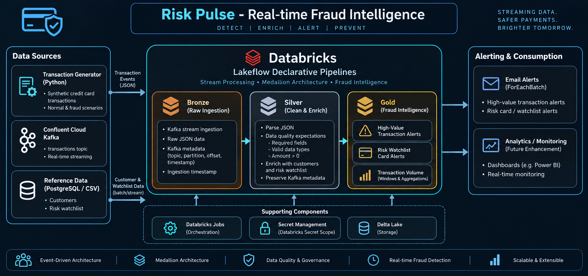

# Risk Pulse — Real-Time Fraud Intelligence Platform

Risk Pulse is an end-to-end **real-time fraud intelligence platform** built using **Python, Apache Kafka, Confluent Cloud, Databricks, PySpark, Delta Lake, and PostgreSQL/CSV reference data**.

The platform simulates credit-card transactions, publishes events to Kafka, processes them through a **Bronze → Silver → Gold medallion architecture** in Databricks, enriches transactions with customer and risk-watchlist data, detects fraud conditions, and generates operational alerts through email sinks.

---

## Architecture



The platform follows an event-driven architecture:

```text
Python Transaction Generator
          │
          ▼
   Confluent Cloud Kafka
          │
          ▼
       Databricks
          │
   ┌──────┴──────┐
   ▼             ▼
 Bronze       Reference Data
   │          Customers / Watchlist
   ▼             │
 Silver ◀────────┘
   │
   ▼
  Gold
   │
   ├── High-value transaction alerts
   ├── Risk watchlist/card alerts
   └── Transaction-volume metrics
   │
   ▼
Email Alert Sinks
```

---

## Pipeline in Action

The Databricks pipeline was executed as a streaming workload, processing transaction and risk-watchlist data through the Bronze, Silver, and Gold layers and routing alert outputs to email sinks.


The pipeline graph demonstrates:

- Real-time Kafka transaction ingestion
- Bronze and Silver streaming tables
- Silver-layer data-quality expectations
- Risk-watchlist processing
- Gold-layer fraud alert generation
- Transaction-volume window aggregations
- `ForEachBatch` email notification sinks

---

## Key Features

### Real-Time Transaction Streaming

Synthetic credit-card transactions are continuously generated using Python and published to a Kafka topic through Confluent Cloud.

The Kafka producer is configured with reliability and secure transport settings including:

- SASL/SSL authentication
- `acks=all`
- Producer retries
- Idempotent delivery

---

### Rule-Based Fraud Detection

The Python fraud engine evaluates transactions using weighted business rules, including:

- High-value transaction
- Impossible travel
- New/untrusted device
- High-risk merchant
- Blacklisted merchant
- International transaction
- Transaction velocity
- Card-testing behavior

The fraud engine produces a risk score capped at `100` together with a fraud reason.

> **Note:** The current implementation uses rule-based fraud detection, not machine learning.

---

# Medallion Architecture

## Bronze — Raw Streaming Ingestion

The Bronze layer consumes Kafka events using Spark Structured Streaming and preserves the raw JSON payload along with Kafka metadata.

Retained metadata includes:

- Kafka topic
- Partition
- Offset
- Kafka timestamp
- Ingestion timestamp

```text
Confluent Cloud Kafka
        │
        ▼
riskpulse.bronze.transactions
```

The Bronze layer acts as the raw landing layer for the streaming transaction data.

---

## Silver — Parsing, Validation and Enrichment

The Silver layer parses the Kafka JSON payload into a strongly typed Spark schema and applies Databricks data-quality expectations.

Key validation rules include:

```text
transaction_id IS NOT NULL
customer_id IS NOT NULL
card_number IS NOT NULL
merchant_id IS NOT NULL
amount > 0
```

Customer and risk-watchlist data are also processed for downstream enrichment and fraud matching.

```text
riskpulse.bronze.transactions
              │
              ▼
       Parse JSON payload
              │
              ▼
      Data quality checks
              │
              ▼
    riskpulse.silver.transactions
```

Kafka metadata is retained in the Silver layer to provide traceability back to the originating Kafka event.

---

## Gold — Fraud Intelligence

The Gold layer transforms validated streaming data into business-facing fraud intelligence.

### High-Value Transaction Alerts

Transactions are compared with each customer's configured transaction limit.

```text
Transaction Amount > Customer Limit
                │
                ▼
     HIGH_VALUE_TRANSACTION
                │
                ▼
          Gold Alert Table
```

This allows transactions exceeding customer-specific thresholds to be identified and routed for notification.

---

### Risk Watchlist Alerts

Transactions are joined with the risk watchlist using card-level identifiers.

The resulting alert contains transaction information together with watchlist attributes such as:

- Watchlist ID
- Watch type
- Risk level
- Action
- Reason code
- Reason description
- Effective timestamp
- Reporting source
- Watchlist location

```text
Silver Transactions
        │
        ├──────────────┐
        │              │
        ▼              ▼
   Customers     Risk Watchlist
        │              │
        └───────┬──────┘
                ▼
       Watchlist Match
                │
                ▼
       Gold Risk Card Alert
```

---

### Transaction Volume Monitoring

The Gold layer also produces transaction-count metrics using event-time windows.

Current outputs include:

- Transaction count by minute
- Sliding-window transaction counts

These provide visibility into transaction activity and short-term transaction velocity.

---

# Streaming and Event-Time Processing

The streaming pipelines use **Spark Structured Streaming** and event-time watermarks for time-sensitive processing.

A five-minute watermark is used for the relevant transaction and watchlist streaming operations.

This supports:

- Stateful streaming joins
- Windowed aggregations
- Late-arriving event handling
- Controlled streaming state retention

---

# Alerting

Gold alert tables are connected to Python email sinks using `ForEachBatch`.

Current alert sinks include:

```text
high_value_transaction_email_sink.py
risk_card_alert_email_sink.py
```

The operational flow is:

```text
Kafka Event
    │
    ▼
Bronze
    │
    ▼
Silver
    │
    ▼
Fraud Detection + Enrichment
    │
    ▼
Gold Alert
    │
    ▼
Email Notification
```

This allows fraud events identified in the streaming pipeline to be converted into operational notifications.

---

# Data Quality and Traceability

The Silver transaction pipeline uses Databricks expectations to validate critical transaction fields before downstream processing.

Examples include:

```text
transaction_id IS NOT NULL
customer_id IS NOT NULL
card_number IS NOT NULL
merchant_id IS NOT NULL
amount > 0
```

Kafka metadata is also preserved in the Silver layer, allowing records to be traced back to:

- Kafka topic
- Kafka partition
- Kafka offset
- Kafka timestamp
- Bronze ingestion timestamp

This provides a foundation for debugging and operational troubleshooting.

---

# Technology Stack

| Category | Technology |
|---|---|
| Programming | Python |
| Streaming | Apache Kafka |
| Kafka Platform | Confluent Cloud |
| Stream Processing | Databricks / PySpark |
| Pipeline Framework | Lakeflow Declarative Pipelines |
| Storage | Delta Lake |
| Architecture | Bronze / Silver / Gold Medallion Architecture |
| Reference Data | PostgreSQL / CSV |
| Alerting | Python Email Sinks |
| Security | Databricks Secret Scope |
| Version Control | Git / GitHub |

---

# Repository Structure

```text
risk-pulse-real-time-fraud-intelligence/
│
├── kafka_producer/
│   ├── config.py
│   ├── customer_generator.py
│   ├── merchant_generator.py
│   ├── transaction_generator.py
│   ├── fraud_engine.py
│   ├── models.py
│   ├── producer_normal.py
│   ├── producer_fraud_transactions.py
│   ├── producer_fraud_card.py
│   ├── requirements.txt
│   └── utils.py
│
├── databricks/
│   ├── risk_watchlist_file_generator/
│   ├── riskpulse_customer_silver_ingestion/
│   ├── riskpulse_streaming/
│   │   ├── bronze/
│   │   ├── silver/
│   │   ├── gold/
│   │   └── alerts/
│   ├── setup/
│   └── tests/
│
├── postgres_sql/
│
├── docs/
│   └── images/
│       ├── risk-pulse-architecture.png
│       └── risk-pulse-pipeline.png
│
├── LICENSE
└── README.md
```

---

# Security and Configuration

Sensitive Kafka credentials are **not stored in the repository**.

The Databricks streaming ingestion uses a dedicated secret scope to retrieve Kafka connection details securely.

For local execution, users must provide their own Kafka environment configuration and credentials.

> **Never commit API keys, API secrets, passwords, or connection strings to GitHub.**

---

# Testing

The repository contains separate test scripts for validating core components, including:

- Kafka streaming connectivity
- Email notification functionality
- Auto Loader behavior

The test scripts are kept separate from the main Bronze/Silver/Gold implementation.

---

# Running the Project

## 1. Clone the repository

```bash
git clone https://github.com/Parthiv7/risk-pulse-real-time-fraud-intelligence.git

cd risk-pulse-real-time-fraud-intelligence
```

## 2. Install Python dependencies

```bash
cd kafka_producer

python -m venv .venv

source .venv/bin/activate

pip install -r requirements.txt
```

## 3. Configure Kafka

Provide the required Kafka environment configuration:

- Bootstrap server
- API key
- API secret
- Kafka topic

Use your own Confluent Cloud credentials and do not commit them to the repository.

## 4. Configure Databricks

Import/configure the Databricks assets under:

```text
databricks/
```

Create the required Databricks secret scope containing the Kafka connection details.

## 5. Start a producer

The repository contains dedicated producer scripts for normal and fraud-oriented scenarios.

Example:

```bash
python producer_normal.py
```

The Databricks streaming pipeline can then consume and process the events through:

```text
Kafka → Bronze → Silver → Gold → Alerts
```

---

# Engineering Highlights

- Event-driven streaming architecture
- Kafka-based real-time ingestion
- Spark Structured Streaming
- Databricks Lakeflow Declarative Pipelines
- Bronze/Silver/Gold medallion architecture
- Event-time watermarks
- Windowed streaming aggregations
- Stream-to-stream risk-watchlist matching
- Stream-to-static customer enrichment
- Rule-based fraud scoring
- Data-quality expectations
- Kafka topic/partition/offset traceability
- `ForEachBatch` email alert sinks
- Secret-based credential management

---

# Future Enhancements

Potential production-level enhancements include:

- Dead Letter Queue (DLQ) / quarantine processing for malformed events
- Kafka Schema Registry and schema evolution
- Automated CI/CD deployment for Databricks assets
- Terraform-based infrastructure provisioning
- Centralized observability and pipeline monitoring
- ML-based fraud scoring
- Real-time fraud dashboards

These are **future enhancements** and are not part of the current implementation.

---

# Author

**Parthiv Das**

Data Engineering | Python | Kafka | Databricks | PySpark | BigQuery

[GitHub](https://github.com/Parthiv7)

---

# License

This project is licensed under the MIT License. See [LICENSE](LICENSE) for details.
